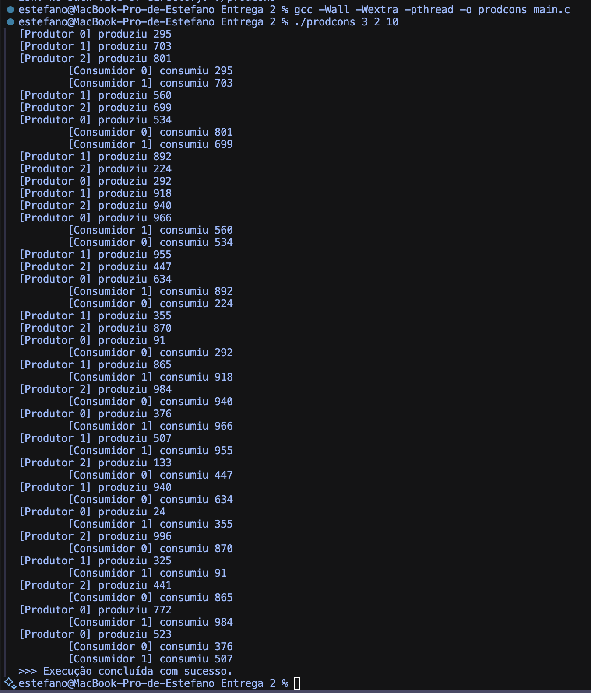

# Módulo 2 S.O.


Estefano Nascimento 7970044

Ligia Keiko Carvalho 13242363

Pyerry Klyzlow Xavier 15484839


# Visão geral do programa

Este código implementa o problema clássico do Produtor-Consumidor descrito no capítulo 2 (“Processos e Threads”) de Sistemas Operacionais Modernos de Andrew S. Tanenbaum.

 O objetivo é demonstrar os mecanismos de sincronização de processos/threads exigidos por um sistema operacional para evitar condições de corrida quando vários agentes partilham um recurso limitado (um “buffer circular”).

* Produtores geram dados aleatórios e tentam depositá-los no buffer.
* Consumidores retiram dados do mesmo buffer e “processam” (apenas imprimem).
* O buffer tem tamanho finito (10 posições); duas posições lógicas — in e out — apontam para a próxima célula livre ou ocupada.
* A solução usa semáforos POSIX (sem_t) para contagem de vagas (empty) e itens (full) e um mutex (pthread_mutex_t) para exclusão mútua dentro da região crítica. Assim as threads dormem quando não podem prosseguir, eliminando busy-waiting.

Conexão com a disciplina – O exercício consolida os conceitos de:

* Exclusão mútua (mutex)
* Sincronização por semáforos contadores (down/up, sem_wait/sem_post)
* Comunicação indireta via memória partilhada
* Escalonamento cooperativo (threads bloqueiam-se voluntariamente)
* Diferença entre seção crítica e sincronização de estado

Esses tópicos aparecem nas seções 2.3 e 2.4 do Tanenbaum.

---

# Como compilar

```
gcc -Wall -Wextra -pthread -o prodcons main.c
```

* A flag -pthread instrui o GCC a linkar a biblioteca POSIX threads.

---

# Como executar

```
./prodcons <n_produtores> <n_consumidores> <itens_por_produtor>
```

Exemplo:

```
./prodcons 3 2 20
```

* Cria 3 threads produtoras e 2 consumidoras.
* Cada produtora gera 20 itens → total de 60 itens produzidos/consumidos.

---

# Saída típica e interpretação

```
[P0] produziu 157

[C1] consumiu 157

[P1] produziu 42

[P2] produziu 883

[C0] consumiu 42

[C1] consumiu 883

...
>>> Execução concluída com sucesso.
```


* Prefixo [P`<id>`] indica o produtor de número id.
* Prefixo [C`<id>`] indica o consumidor de número id.
* A interleaving das linhas muda de uma execução para outra, confirmando o caráter concorrente.
* Nunca aparecem mensagens fora de ordem (por exemplo, dois produtores relatando posições iguais) porque o mutex protege a seção crítica e os semáforos mantêm o estado válido do buffer.

---

# Dados retornados

O programa não devolve valor de saída além de 0 (sucesso).
 As informações relevantes são impressas no terminal, permitindo observar:

* Taxa de produção x consumo (diferença de timestamps se usar time ou ts do shell).
* Bloqueios – Se você reduzir BUFFER_SIZE para 1, verá produtores e consumidores alternarem quase um-a-um, ilustrando o bloqueio em sem_wait.
* Sobrecarga de contexto – Altere usleep para 0 para testar alto volume e medir o escalonamento do SO (útil em laboratórios de desempenho).

---

# Estrutura detalhada das funções

## buffer_init(bounded_buffer_t *b)

Inicializa o buffer circular: zera os índices in e out, cria o mutex de exclusão e define dois semáforos contadores. empty recebe BUFFER_SIZE (todas as posições livres) e full recebe 0 (nenhum item disponível). Deve ser chamada uma única vez no início antes de qualquer thread acessar o buffer.

## buffer_destroy(bounded_buffer_t *b)

Libera os recursos associados ao buffer: destrói ambos os semáforos e o mutex. Boa prática de limpeza antes de encerrar o programa.

## buffer_put(bounded_buffer_t *b, int item)

Implementa a operação “produce”. Primeiro executa sem_wait(&empty) para bloquear se não houver vaga. Depois entra na seção crítica (pthread_mutex_lock), grava o item na posição in, avança in circularmente e desbloqueia o mutex. Por fim, faz sem_post(&full) sinalizando que um novo item está disponível para consumo.

## buffer_get(bounded_buffer_t *b)

Implementa a operação “consume”. Bloqueia em sem_wait(&full) quando o buffer está vazio. Entra na seção crítica, lê o item da posição out, avança out, libera o mutex e faz sem_post(&empty) indicando que uma vaga foi liberada. Retorna o item lido ao chamador.

## producer(void *arg)

Rotina de cada thread produtora. O argumento arg é convertido em id (numero longo). Gera items_per_producer valores pseudo-aleatórios, chama buffer_put para cada um e imprime uma linha identificadora. A chamada a usleep apenas torna a demonstração visual mais clara; remover esta linha não afeta a lógica.

## consumer(void *arg)

Rotina de cada thread consumidora. Converte o argumento em id de consumidor. Executa um laço infinito: obtém item via buffer_get, imprime-o e dorme um curto intervalo. O loop é infinito porque, em muitas simulações de SO, consumidores são processos de serviço contínuo; o programa-driver (main) cancelará as threads depois que todos os produtores terminarem.

## main(int argc, char *argv[])

Função de arranque. Valida a linha de comando, converte parâmetros e chama buffer_init. Cria n_prod threads produtoras e n_cons threads consumidoras. Aguarda (pthread_join) o término das produtoras; em seguida cancela e junta os consumidores (para evitar que fiquem bloqueados em sem_wait). Por fim, destrói o buffer e retorna 0.

# Execução



# Referências bibliográficas

1. TANENBAUM, A. S.; BOS, H.Modern Operating Systems. 4th ed. Pearson, 2015 – Seções 2.3 (“Cooperating Processes”) e 2.4 (“Threads”).
2. IEEE Std 1003.1-2017 – POSIX.1 Base Specifications, § Threads (pthread_*) e § Semaphores (sem_*).
